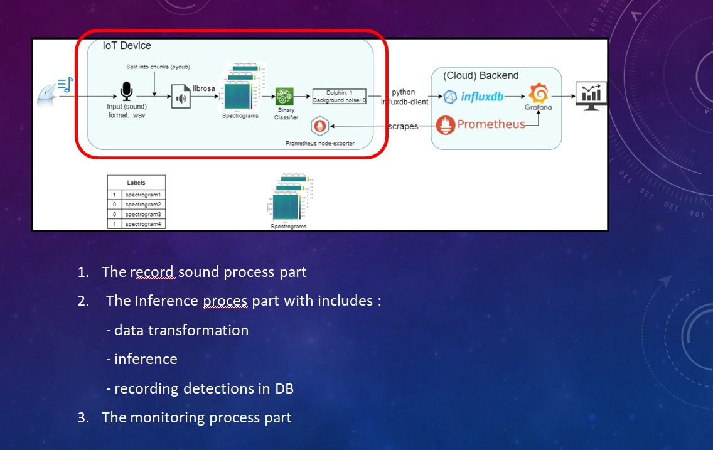
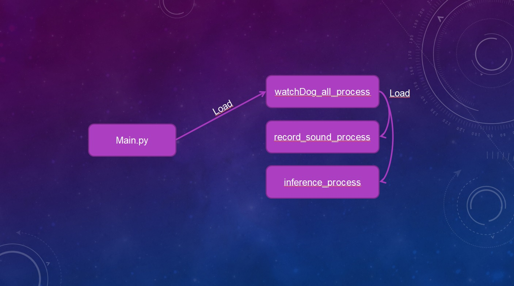
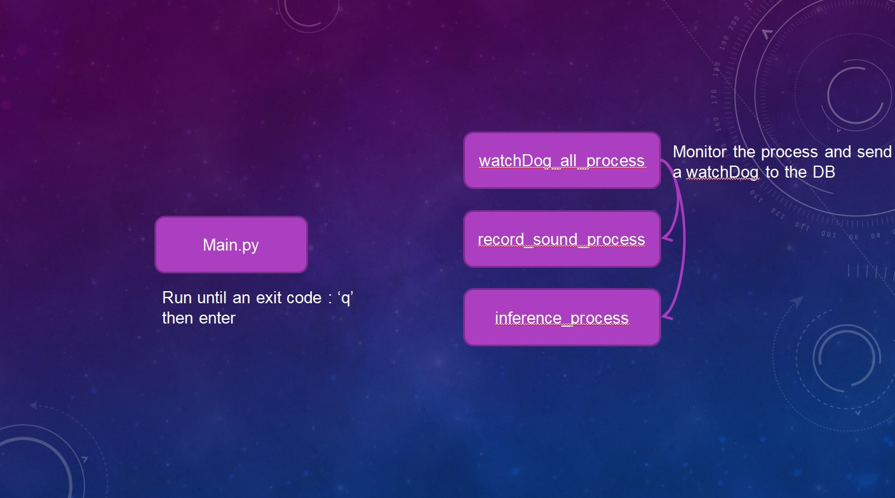
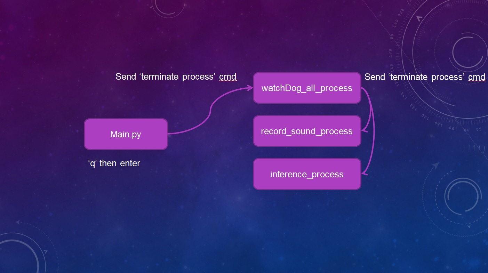
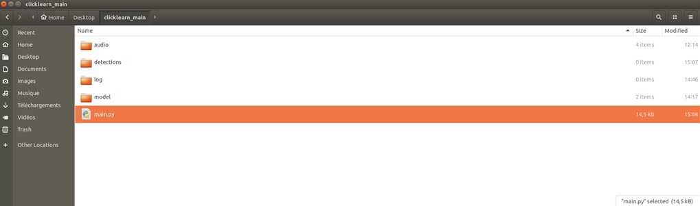
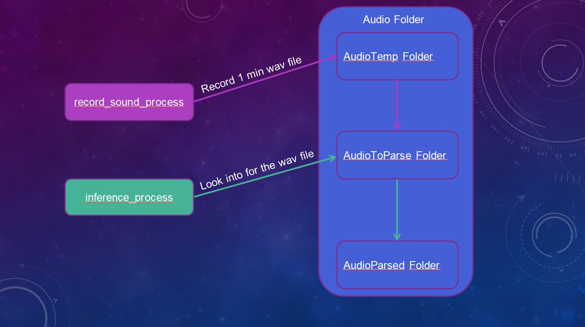

# Python Main Program on Iot Device

In order to run the python main program on the device you will first need to instal some libraries:

logging2 a log library:
- pip install logging2

a client for Influx DB:
- pip install influxdb-client

## Main program architecture:

The program has different functions which must operate independently and asynchronously. These differents functions could not be performed in a single process so we have to handle them with the multiprocessing library.

We have in total 4 processes. The main process witch loads the 'watchDog_all_process' which in turn loads two other processes: 'record_sound_process' and 'inference process'.

When the program is started, the main process just waits for an exit code.

The 'watchDog_all_process' with the functionality of the multiprocessing library has access to the state of the other two processes and monitor it all 5 min.

When main process receives the exit code, it then sends a terminate process cmd to the 'watchDog_all_process' which also sends the same signal to the other processes.

The main process waits for all processes to finish before terminating.

In differents folders are stored :

- the audio files which are recorded

- all the detections made by the model in a csv file

- the logs of each processes

- the model used for the detection

## Record sound process details:

The sound files are recorded continuously by the 'record sound process', during recording there is only one file in the 'audio temp folder', once these file is 1 min long the recording is stopped and the file is moved to the 'AudioToParse Folder' then the recording resumes and so on.

The 'Inference process' checks every min if there is one or several files to process in the 'AudioToParse Folder' if yes it performs the inference process on it otherwise it sleeps during 1 min.

When the inference process is done if there are detections on the sound file we move it in the 'AudioParsed Folder' otherwise we delete it.

